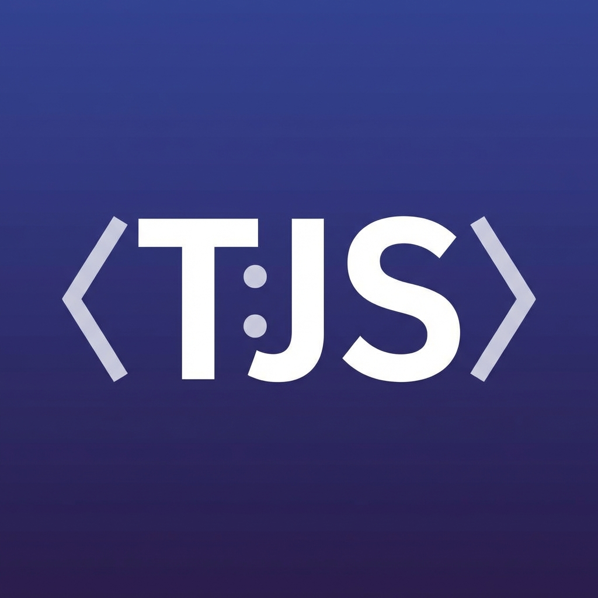

# TypedJS for VS Code

[](https://marketplace.visualstudio.com/items?itemName=razinshafayet.typedjs-vscode)
[](https://marketplace.visualstudio.com/items?itemName=razinshafayet.typedjs-vscode)



Language support for **TypedJS** - bringing runtime type safety to JavaScript.

## 🚀 Quick Start

### 1. Install the TypedJS CLI
```bash
npm install -g @razinshafayet/typedjs
```

### 2. Install this VS Code Extension

**From Marketplace:**
- Search for "TypedJS" in VS Code Extensions (Ctrl+Shift+X)
- Click Install

**From Command Line:**
```bash
code --install-extension razinshafayet.typedjs-vscode
```

### 3. Write TypedJS Code

Create a `.js` file and change language mode to **TypedJS** (bottom-right corner):
```javascript
interface User {
    name: string;
    age: number;
}

const user: User = {
    name: "Razin",
    age: 18
};

console.log(user);
```

### 4. Run Your Code

**Development Mode** (with runtime type checking):
```bash
typedjs app.js
```

**Production Mode** (types stripped for performance):
```bash
typedjs app.js --prod
```

---

## ✨ Features

- 🎨 **Syntax Highlighting** - Colorful, readable code for TypedJS annotations
- ✅ **Type Validation** - Integrated linting catches type errors in the editor
- 📝 **Code Snippets** - Quick scaffolding for interfaces, types, and more
- 💡 **IntelliSense** - Smart autocompletion for keywords and types
- 🔍 **Hover Information** - View type definitions on hover

## 📦 Code Snippets

| Prefix | Description |
|--------|-------------|
| `interface` | Create a new interface |
| `type` | Create a type alias |
| `log` | Console log statement |

## 🔧 Usage Examples

**Basic Types:**
```javascript
let name: string = "TypedJS";
let age: number = 25;
let isActive: boolean = true;
```

**Interfaces:**
```javascript
interface Product {
    id: number;
    name: string;
    price: number;
    inStock?: boolean;  // Optional property
}

const laptop: Product = {
    id: 1,
    name: "MacBook",
    price: 1299
};
```

**Type Aliases & Unions:**
```javascript
type ID = string | number;
type Status = "active" | "inactive" | "pending";

let userId: ID = 123;
let status: Status = "active";
```

**Arrays & Functions:**
```javascript
let scores: Array<number> = [10, 20, 30];

function greet(name: string): string {
    return `Hello, ${name}!`;
}
```

## ⚙️ Requirements

- **VS Code** 1.80.0 or newer
- **Node.js** 14.0.0 or newer (for TypedJS CLI)
- **TypedJS CLI** - Install with: `npm install -g @razinshafayet/typedjs`

**Required Extensions:**
- **ESLint extension** - Installs automatically when you install TypedJS
- Provides type validation in the editor
- No manual configuration needed!

## 🐛 Known Issues

This is an early release (v0.0.3). Some known limitations:

- Advanced type inference not yet implemented
- Some edge cases in syntax highlighting
- Limited language server features

Please report issues on [GitHub](https://github.com/RazinShafayet2007/typedjs-vscode/issues).

## 🔗 Related Projects

**TypedJS CLI** - [npm](https://www.npmjs.com/package/@razinshafayet/typedjs) | [GitHub](https://github.com/RazinShafayet2007/typedjs)

The runtime and CLI tool for executing TypedJS code.

## 📋 Release Notes

### 0.0.4 (January 26, 2026)

**Added:**
- 🔄 Seamless ESLint integration - ESLint now bundled with extension
- ⚙️ Automatic ESLint configuration - zero setup required
- 🛡️ Comprehensive .gitignore with all necessary exclusions

**Fixed:**
- 🐛 Fixed ESLint installation - moved to dependencies for proper bundling
- 🚫 Eliminated unwanted .vscode/settings.json auto-generation
- 🔧 Simplified extension activation for cleaner ESLint integration

**Changed:**
- 📦 Improved ESLint bundle strategy for better user experience
- 🎨 Extension now works immediately after installation

### 0.0.3 (January 24, 2025)

**Changed:**
- ✨ Added comprehensive CLI installation and usage instructions
- 📝 Improved README with complete quick start guide
- 🔗 Added links to TypedJS CLI npm package
- 📚 Added more code examples

### 0.0.2 (January 23, 2025)

**Changed:**
- 🧹 Removed redundant `activationEvents` from `package.json`

## 🤝 Contributing

Found a bug? Have a feature request? 

- [Report Issues](https://github.com/RazinShafayet2007/typedjs-vscode/issues)
- [Contribute on GitHub](https://github.com/RazinShafayet2007/typedjs-vscode)

## 📄 License

MIT License - see [LICENSE](LICENSE) file for details.

---

**Made with ❤️ by [Razin Shafayet](https://github.com/RazinShafayet2007)**